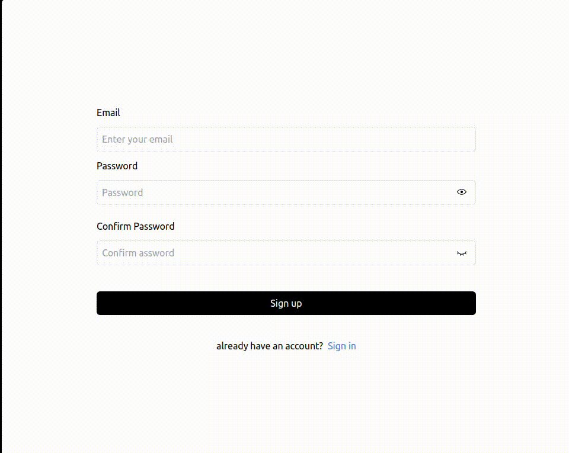

# react-password-Checker👽

## Install

```bash
npm install --save react-password-cheker
```

## Usage ✍️

##### React Password Checker is a simple and lightweight library that helps you validate and check passwords in your React applications. It provides two components: <Rules /> and <Match /> that can be easily added to your password form.


## `<Rules />` Component

### import:

```js
import { Rules } from 'react-password-checker'
```

The <Rules /> component helps you show the password validation rules to the user while they are typing in their password. It takes the following props:

| proprety                      | Description                                                                                       |
| ----------------------------- | ------------------------------------------------------------------------------------------------- |
| `password (required)`         | A string that represents the password entered by the user.                                        |
| `min (required)`              | An integer that represents the minimum length of the password. Default is `10`                    |
| `max (required)`              | An integer that represents the maximum length of the password. Default is `30`                    |
| `lower (optional)`            | A boolean that indicates whether the password requires a lowercase character. Default is `true`.  |
| `upper (optional)`            | A boolean that indicates whether the password requires an uppercase character. Default is `true`. |
| `digits (optional)`           | A boolean that indicates whether the password requires a digit. Default is `true`.                |
| `specialCharacter (optional)` | A boolean that indicates whether the password requires a special character. Default is `true`     |
| `isActive (required)`         | A boolean that indicates whether to show the rules component or not. Default is `true`.           |
| `display (optional)`          | A string that represents the display style of the rules component. Default is `color`.            |

Here's an example of how to use the `<Rules />` component in your password form:

### example:

```js
import { useState } from 'react'
import { Rules } from 'react-password-checker'

function PasswordForm() {
  const [password, setPassword] = useState('')

  const [isActive, setIsActive] = useState(false)
  const handleFocus = () => {
    setIsActive(true)
  }
  const handleBlur = () => {
    setIsActive(false)
  }

  return (
    <form>
      <label htmlFor='password'>Password</label>
      <input
        type='password'
        id='password'
        value={password}
        onChange={(event) => setPassword(event.target.value)}
      />
      <Rules
        password={password}
        min={8}
        max={20}
        lower={true}
        upper={true}
        digits={true}
        specialCharacter={true}
        isActive={true}
        display='block'
      />
      <button type='submit'>Submit</button>
    </form>
  )
}
```

## `<Match />` Component:

### import:

```js
import { Match } from 'react-password-checker'
```

The <Match /> component helps you confirm whether the user has entered the correct password in a sign-up or password reset form. It takes the following props:

| proprety                     | Description                                                                           |
| ---------------------------- | ------------------------------------------------------------------------------------- |
| `password (required)`        | A string that represents the password entered by the user.                            |
| `confirmPassword (required)` | A string that represents the confirm password entered by the user.                    |
| `isActive (required)`        | A boolean that indicates whether to show the match component or not. Default is true. |
| `display (optional)`         | A string that represents the display style of the match component. Default is block.  |

Here's an example of how to use the <Match /> component in your password form:

### example:

```js
import { useState } from 'react';
import { Match } from 'react-password-checker';

function SignupForm() {
  const [password, setPassword] = useState('');
  const [confirmPassword, setConfirmPassword] = useState('');
  const [isActive, setIsActive] = useState(false);
  const confirmPasswordInputRef = useRef();
    const handleFocus = () => {
    setIsActive(true);
  };
  const handleBlur = () => {
    setIsActive(false);
  };

  return(
    <div>
      <form>
      <input
        type="password"
        name="password"
        required

        onFocus={handleFocus}
        onBlur={handleBlur}
        value={confirmPassword}
        onChange={handleConfirmPassword}
        placeholder="Password"
        />
      <Match
        isActive={isActive}
        password={password}
        confirmPassword={confirmPassword}
        display={"color"}
      />
      </form>
    </div>
  )
```

#### Warning:⛔️





!> in both `<Rules />` and `<Match />`, you should pass `isActive` proprety,which you can get by using `onFocus` and `onBlur` on the input elemnt, otherwise the components won't be displayed.


!> `<Rules />` and `<Match />` should have the same display proprety. Default is `color`.

| display | Description                                                                    |
| ------- | ------------------------------------------------------------------------------ |
| `color` | color will change the color of invalid rule to red and the valid ones to green |
| `line`  | if a rules is validated it will be marked with a line through                  |

## `usePassword()` hook

### import:

```js
import { usePassword } from 'react-password-checker'
```

| proprety                     | Description                                                                    |
| ---------------------------- | ------------------------------------------------------------------------------ |
| `password (required)`        | A string that represents the password entered by the user.                     |
| `confirmPassword (optional)` | A string that represents the confirm password entered by the user.             |
| `min (required)`             | An integer that represents the minimum length of the password. Default is `10` |
| `max (required)`             | An integer that represents the maximum length of the password. Default is `30` |

The usePassword hook is a custom React hook that takes an object as an argument, which contains properties such as password, confirmPassword, min, and max. The hook then returns an array of boolean values representing the validation results of the password based on certain criteria.

Finally, the hook returns an array of the boolean values representing whether the password satisfies each of the criteria checked in the useEffect hook. These boolean values can be used to conditionally render certain UI elements in a React component, such as the strength of the password or whether the password matches the confirmation password.

### example:

```js
const [
  hasDigit,
  hasSpecialChar,
  isMatch,
  hasUpperCase,
  hasValidLength,
  hasLowerCase
] = usePassword({
  password: password,
  min: 10,
  max: 30
})
```

## License

MIT © [duckduckcodes](https://github.com/duckduckcodes)
